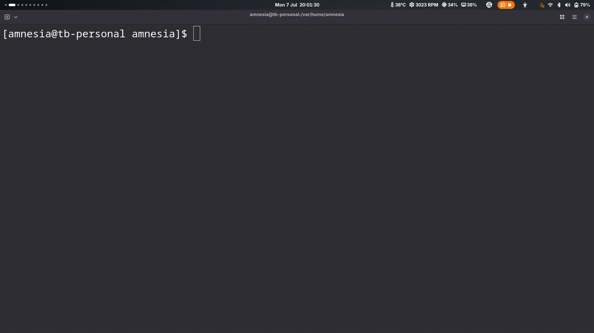

# nvmenu.nvim

Use your Neovim as a fuzzy finder.

## Preview


## Installation

Using [lazy.nvim](https://github.com/folke/lazy.nvim):

```lua
{
  'iruzo/nvmenu.nvim',
  version = '*',
  cmd = {'Nvmenu', 'NvmenuLua', 'NvmenuShell'},
  config = function()
    require'nvmenu'
  end
},
```

## Usage

### Manual Commands

**Simple copy (default):**
```vim
:Nvmenu
```

**Process with Lua function:**
```vim
:NvmenuLua function(text) local parts = vim.split(text, '|', {plain=true}); return parts[2] and parts[2]:gsub(' ', '\n') or text end
```

**Process with shell command:**
```vim
:NvmenuShell cut -d'|' -f2 | tr ' ' '\n'
```

### Direct Execution with Files

You can use nvmenu.nvim directly when opening files:

**With piped content:**
```bash
cat your_file.txt | nvim -c "Nvmenu"
```

**With direct file:**
```bash
nvim your_file.txt -c "Nvmenu"
```

## How it works

1. Opens the fuzzy finder ui
2. Optionally processes the selected text with Lua function or shell command
3. Copies the result to your system clipboard (using the `+` register)
4. Closes Neovim immediately after selection

## Examples

**Extract content after delimiter (like `cut -d'|' -f2`):**
```vim
:NvmenuLua function(text) local parts = vim.split(text, '|', {plain=true}); return parts[2] or text end
```

**Replace spaces with newlines (like `tr ' ' '\n'`):**
```vim
:NvmenuLua function(text) return text:gsub(' ', '\n') end
```

**Combine operations (like `cut -d'|' -f2 | tr ' ' '\n'`):**
```vim
:NvmenuShell cut -d'|' -f2 | tr ' ' '\n'
```
